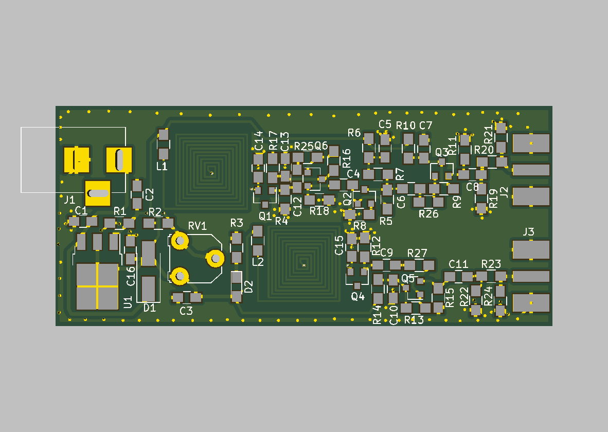

This is a RF noise source based on a cheaply available 2SC3356 Bipolar Transistor by Daniel L. Marks, KW4TI.  This is an experiment to see how much noise a reversed biased emitter-base can create.

The PCB design is distributed under the Creative Commons Shared Alike Attribution (CC-BY-SA 4.0) license.

